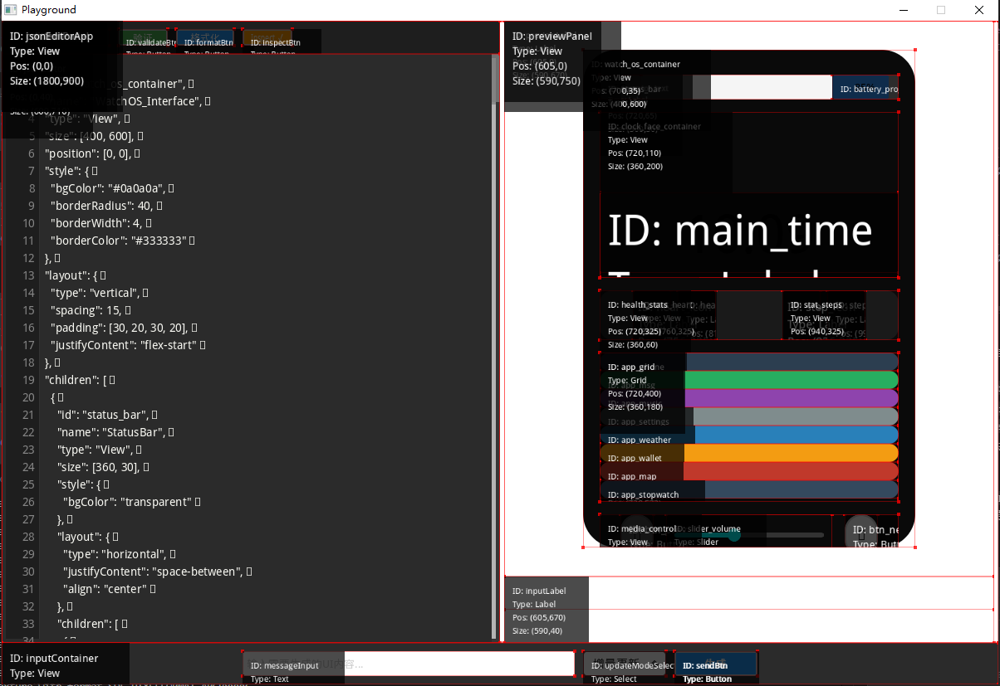
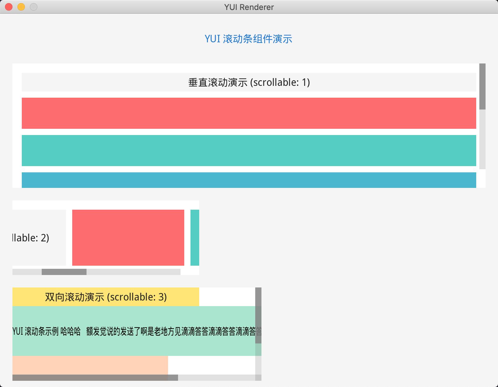
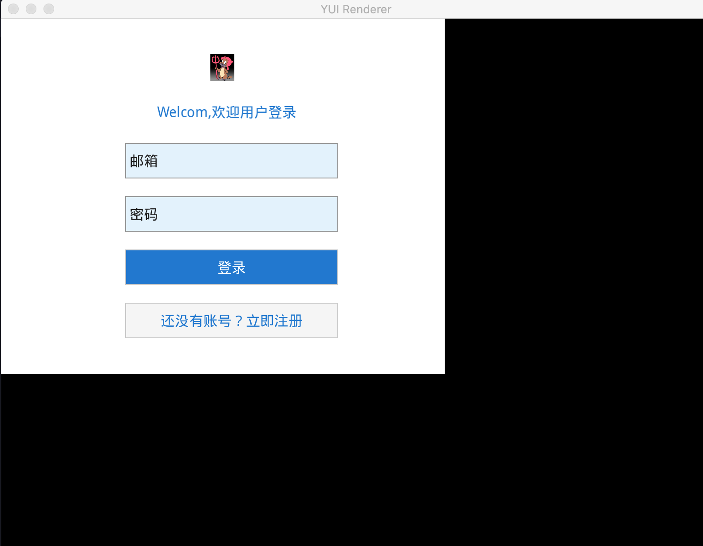

# YUI - Yet another User Interface

[](LICENSE)
[](https://en.wikipedia.org/wiki/C_(programming_language))
[](#)

YUI is a lightweight GUI framework designed for AI applications, built with C language and configured via JSON. It features high performance, easy extensibility, and cross-platform support.

## 🌟 Key Features

- **Lightweight & High Performance**: Optimized rendering pipeline with dirty rectangle rendering
- **Declarative UI**: Describe interfaces using intuitive JSON configuration
- **Cross Platform**: Supports Windows, macOS, and Linux
- **Rich Components**: Built-in support for buttons, inputs, lists, grids, dialogs, and more
- **Animation System**: Smooth animations with various easing functions
- **Theme System**: Dynamic theme switching with JSON-based styling
- **Multiple JS Engines**: Support for QuickJS, mquickjs, and Mario JavaScript engines
- **Network Support**: Built-in socket and HTTP client capabilities

## 🚀 Quick Start

### Installation

Clone the repository:

```bash
git clone https://github.com/evilbinary/YUI.git
cd YUI
```

### Dependencies

Install required libraries:

**Windows (MSYS2)**:
```bash
pacman -S mingw-w64-x86_64-SDL2
pacman -S mingw-w64-x86_64-SDL2_ttf
pacman -S mingw-w64-x86_64-SDL2_image
pacman -S mingw-w64-x86_64-cjson
pacman -S mingw-w64-x86_64-dlfcn
```

**macOS**:
```bash
brew install sdl2 sdl2_ttf sdl2_image cjson
```

**Linux (Ubuntu/Debian)**:
```bash
sudo apt-get install libsdl2-dev libsdl2-ttf-dev libsdl2-image-dev libcjson-dev
```

### Build & Run

```bash
# Build the project
python ya.py -b yui

# Run the application
python ya.py -r yui
```

### Basic Configuration

Create a main configuration file (`app.json`):

```json
{
    "type": "main",
    "assets": "app/assets",
    "font": "Roboto-Regular.ttf",
    "fontSize": "16",
    "source": "app/ui/main.json"
}
```

Create your UI definition (`app/ui/main.json`):

```json
{
    "id": "main_window",
    "type": "View",
    "position": [0, 0],
    "size": [800, 600],
    "style": {
        "bgColor": "#2C3E50"
    },
    "children": [
        {
            "id": "hello_label",
            "type": "Label",
            "position": [300, 250],
            "size": [200, 50],
            "text": "Hello, YUI!",
            "style": {
                "color": "#ECF0F1",
                "fontSize": 24
            }
        }
    ]
}
```

## 📚 Documentation

### Core Documentation

- [Framework Features](docs/feature.md) - Detailed feature documentation
- [JSON Format Specification](docs/json-format-spec.md) - Complete JSON configuration guide
- [JavaScript API Reference](docs/yui-js-api.md) - Full JS API documentation
- [Theme System Guide](docs/theme.md) - Theme management and customization

### Component Guides

- [Dialog Component](docs/dialog-component.md) - Modal and non-modal dialogs
- [Select Component](docs/select-component.md) - Dropdown selection controls
- [Layout System](docs/layout.md) - Flexible layout management

### Advanced Topics

- [Performance Optimization](docs/blur-performance-optimization.md) - Rendering performance tips
- [Glass Effect Guide](docs/glass-effect-guide.md) - Visual effects implementation
- [Transparent Support](docs/transparent-support-guide.md) - Transparency handling

## 🖼️ Screenshots

<div style="display: flex; gap: 20px; flex-wrap: wrap;">
  
  
  
</div>

## 🏗️ Architecture Overview

YUI follows a layered architecture design:

```
┌─────────────────────────────────────┐
│           Application Layer         │  ← Your App Logic
├─────────────────────────────────────┤
│           JavaScript Engine         │  ← QuickJS/mquickjs/Mario
├─────────────────────────────────────┤
│            Event System             │  ← Input Handling
├─────────────────────────────────────┤
│           Layout Manager            │  ← UI Layout Calculation
├─────────────────────────────────────┤
│          Render Pipeline            │  ← Graphics Rendering
├─────────────────────────────────────┤
│           Backend Layer             │  ← SDL2/Graphics API
└─────────────────────────────────────┘
```

## 🤝 Contributing

Contributions are welcome! Please read our [Contribution Guidelines](CONTRIBUTING.md) before submitting pull requests.

## 📄 License

This project is licensed under the GNU Lesser General Public License v2.1 (LGPL-2.1) - see the [LICENSE](LICENSE) file for details.

**Key Points of LGPL-2.1:**
- You can freely use, modify, and distribute this library
- If you modify the library itself, you must release your changes under LGPL-2.1
- You can link this library with proprietary software
- When distributing binaries, you must provide access to the library's source code

For commercial use inquiries, please contact the maintainers.

## 🙏 Acknowledgments

- [SDL2](https://www.libsdl.org/) - Cross-platform development library
- [cJSON](https://github.com/DaveGamble/cJSON) - Ultralightweight JSON parser
- [QuickJS](https://bellard.org/quickjs/) - Small and embeddable JavaScript engine

---

<p align="center">Made with ❤️ for the open-source community</p>

