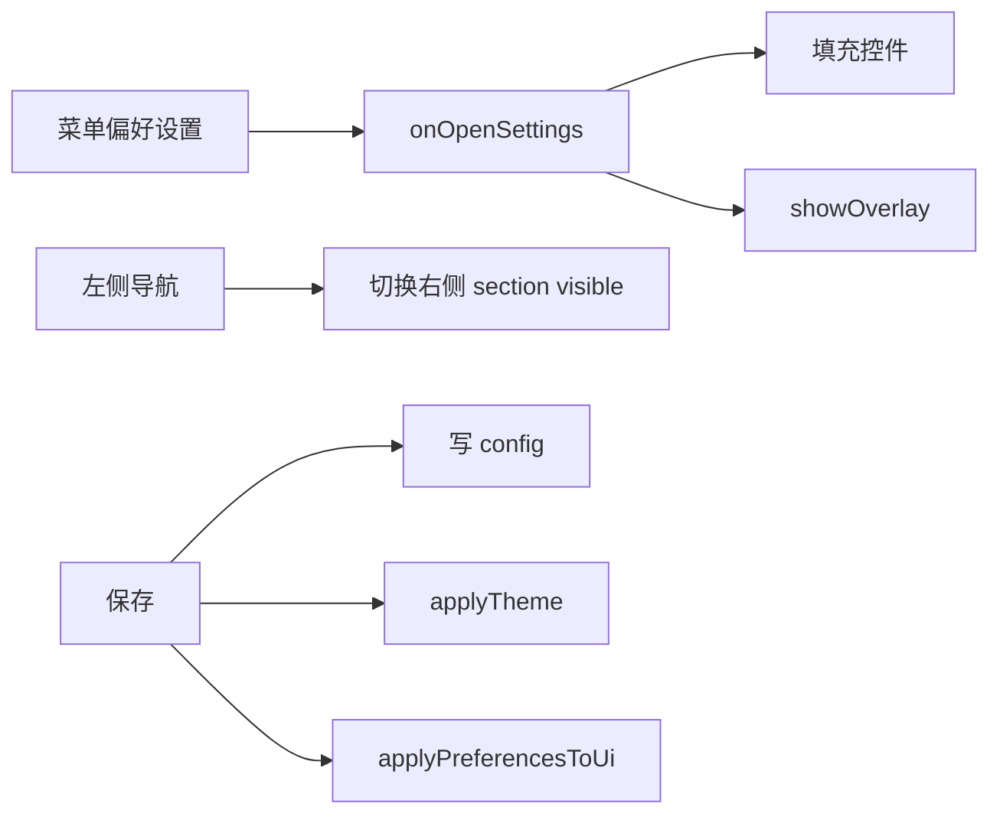

# DB 偏好设置（双栏卡片）设计方案

> 版本：v0.1  
> 日期：2026-07-24  
> 状态：已实现（V1）  
> 参考：Cursor Settings 双栏布局（左导航 + 右卡片），按 YUI / KISS 收敛

## 目标效果（对齐截图，但不照搬复杂度）

```text
┌─────────────────────────────────────────────┐
│ 偏好设置                              [×]   │
├──────────────┬──────────────────────────────┤
│ 搜索(可后做)  │  外观                        │
│              │  ┌────────────────────────┐  │
│ ● 外观       │  │ 主题 / 字体大小 …      │  │
│   编辑器     │  └────────────────────────┘  │
│   查询结果   │  编辑器                      │
│   连接       │  ┌────────────────────────┐  │
│              │  │ 自动连接 …             │  │
│              │  └────────────────────────┘  │
│              │                    [取消][保存]│
└──────────────┴──────────────────────────────┘
```

视觉原则（贴合当前 Mocha / Element Plus 主题，而不是 Cursor 灰）：

- 左侧导航：略深底色；选中项圆角高亮（`bgColor` 略亮）
- 右侧内容：分区小标题（灰色）+ **卡片**（圆角 8、内边距 16、比页面底略亮）
- 行布局：左标题+说明，右控件（Checkbox / Input / Button）
- 不追求 Switch / Progress / 空状态；V1 用现有组件即可

## 信息架构（按现有配置项）

当前 `app/db/db-config.json` 只有：`autoConnect`、`pageSize`、`fontSize`、`theme`。

建议归类：

| 导航 | 卡片内容 |
|------|----------|
| 外观 | 主题选择（列表按钮或紧凑选项）、编辑器字号 |
| 查询结果 | 分页大小 |
| 连接 | 启动自动连接 |

把现在的「主题设置」弹窗并进「外观」，菜单只留「偏好设置」。

## 用现有组件拼装（不新增 C 组件）

在 `app/db/db.json` 用 overlay 大面板（约 720×480）：

- 根：`View` absolute overlay
- 左栏 `prefNav`：`vertical` + 若干 `Label`/`Button`（`variant: navItem` / `navItem.active`）
- 右栏 `prefContent`：`vertical` + `scrollable: 1`
  - 每个分区：`Label` 小标题 + `View` 卡片（`variant: settingsCard`）
  - 卡片内行：`horizontal`，左 `Label` 标题/说明，右 `Checkbox` / `Input` / `Button`
- 底栏：取消 / 保存（沿用现有 `onPreferencesOk` / `onPreferencesCancel`）

主题样式加到 `app/db/themes/*.json`：

```json
{ "selector": "View.settingsCard", "style": { "bgColor": "...", "borderRadius": 8 } }
{ "selector": "Label.navItem", "style": { } }
{ "selector": "Label.navItem.active", "style": { } }
{ "selector": "Label.sectionTitle", "style": { "color": "...", "fontSize": 11 } }
```

## 交互（JS，改动面小）

`app/db/db.js`：

1. `onOpenSettings`：填充控件 + `showOverlay`
2. 导航点击：切换右侧各 section 的 `visible`（V1 用 visible 最简单）
3. `onPreferencesOk`：读控件 → `appPreferences` / `currentTheme` → `applyTheme` + `saveDbConfig`
4. 删除/弱化独立 `themeDialogOverlay`，菜单「主题设置」改为打开偏好并定位到「外观」



## 明确不做（保持 KISS）

- 不做独立 Switch 组件（用 Checkbox）
- 不做设置内搜索 / Ctrl+F
- 不做 Progress、Docs 空状态那类装饰
- 不改 C 层主题引擎；只加 JSON selector

## 落地文件

- `app/db/db.json`：重做 `preferencesDialogOverlay` 双栏结构；主题项并入
- `app/db/db.js`：导航切换、保存合并主题、菜单入口收敛
- `app/db/themes/mocha.json` 等：补 `settingsCard` / `navItem` / `sectionTitle`

## 验收

- 打开偏好：左导航可切换外观 / 查询 / 连接
- 改主题、字号、分页、自动连接后点保存，立刻生效并写回 `db-config.json`
- 取消不落盘
- 切换 Element Plus / Mocha 时卡片与导航高亮颜色正确

## 实现待办

1. ~~`db.json`：双栏 preferences overlay（nav + cards + footer）~~
2. ~~`db.js`：导航切换、保存合并主题、菜单入口收敛~~
3. ~~`themes`：`settingsCard` / `navItem` / `sectionTitle` 样式~~