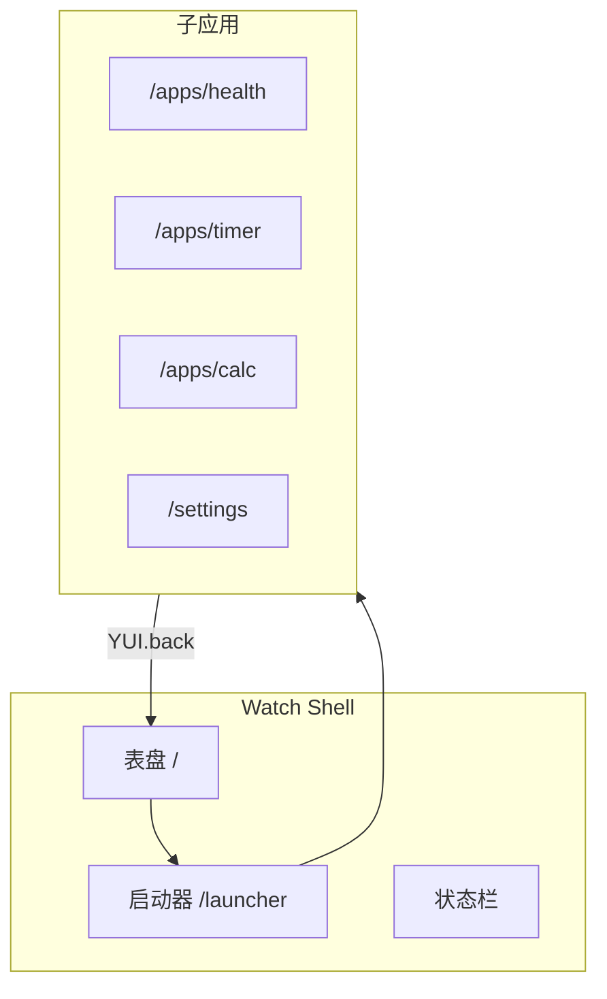

# YUI Watch OS

手表操作系统壳层与多应用 Demo，参照 Apple Watch / Wear OS 功能谱，在 YUI 框架上实现 **390×390 圆角方屏**、主题化 UI 与 Router 多应用导航。

## 快速运行

```bash
ya -b playground -r
.\build\None\None\None\playground.exe .\app\watch-os\app.json
```

## 目录结构

每个应用独立 `<name>.json` + `<name>.js`，壳层 `app.json` 只含状态栏与 `page_outlet`。

```
app/watch-os/
├── app.json                 # 壳：状态栏 + page_outlet（js 仅 router/theme/app.js）
├── app.js                   # 路由、主题、共享数据、导航
├── watch-os.md
└── apps/
    ├── face/
    │   ├── face.json
    │   └── face.js
    ├── launcher/
    │   ├── launcher.json
    │   └── launcher.js
    ├── health/
    │   ├── health.json
    │   └── health.js
    ├── timer/
    │   ├── timer.json
    │   └── timer.js
    ├── settings/
    │   ├── settings.json
    │   └── settings.js
    └── calc/
        ├── calc.json
        └── calc.js

计算器核心逻辑复用 `app/calc/calc.js`，在 `apps/calc/calc.json` 中声明：

```json
"js": ["calc.js", "../../../calc/calc.js"]
```

├── themes/
│   ├── dark.json
│   └── light.json
```

## 实现状态总览

**结论：你列出的完整应用谱尚未全部实现。** 当前仅交付 **P0 壳层 + 6 个可用模块**；启动器里其余品类为灰色占位按钮，无路由、无页面。

| 状态 | 数量 | 含义 |
|------|------|------|
| ✅ 已实现 | 6 | 可打开、有 UI、有基本交互 |
| ⬜ 占位 | 4+ | 启动器显示，按钮不可进入 |
| ❌ 未做 | 30+ | 清单里有，界面与路由均未建 |

### ✅ 已实现（6）

| 模块 | 路由 | 说明 |
|------|------|------|
| 数字表盘 | `/` | 时间、complication、活动环、快捷入口 |
| 应用启动器 | `/launcher` | 可用 App 列表 + 占位项 |
| 健康摘要 | `/apps/health` | 四宫格指标 + 活动进度（非独立训练/睡眠 App） |
| 计时器 | `/apps/timer` | 1/3/5/10 分钟预设 |
| 计算器 | `/apps/calc` | 复用 `calc/calc.js` |
| 设置 | `/settings` | 主题切换、电量、版本 |

### ⬜ 仅占位（启动器可见，未实现）

训练、电话、地图、钱包

### ❌ 未实现（按你原始清单）

| 品类 | 未做应用 |
|------|----------|
| 健康/运动 | 体能训练、独立睡眠、正念、经期、用药 |
| 时间 | 世界钟、闹钟、秒表、表盘商店 |
| 通信 | 电话、信息、邮件、通讯录、对讲机、通知中心 |
| 出行 | 地图导航、指南针、公交、航班、户外路线 |
| 工具 | 语音备忘、录音、相机遥控、手机控制、电量详情、文件管理 |
| 支付/家居 | Wallet、智能家居 |
| AI | 助理、实时翻译 |

## 架构



### 与 shopping 相同模式

- `Router.init` + `YUI.navigate` / `YUI.back`
- `Theme.load` + `Theme.apply`（平台后缀 `-watch`）
- 图层 JSON 使用 `type` + `variant`，颜色在主题中定义
- 动态页面：`{ json: "app/watch-os/apps/calc/calc.json" }`

## 屏幕与主题

- **基准尺寸**：390×390，`View.watch-bezel`（`borderRadius: 24`）
- **主题文件**：`themes/dark.json` / `themes/light.json`（Watch OS 本地，不放在 `app/lib/themes`）
- **加载方式**（`app.js`）：

```javascript
var themePlatform = "watch";
var suffix = themePlatform === "watch" ? "-watch" : "";
Theme.load("app/lib/themes/dark" + suffix + ".json", "dark");
Theme.load("app/lib/themes/light" + suffix + ".json", "light");
```

### 视觉风格（v1.1 霓虹赛博）

- 深空底 `#030308` + 紫蓝面板 `#0F1028`
- 霓虹强调色：青 `#00F0FF`、品红 `#FF2D95`、荧光绿 `#39FF14`、琥珀 `#FFB020`
- 表盘时间区 `View.glow-panel`，complication / 指标卡分色 `neon-a/b/c/d`
- 主 CTA `Button.neon`，未上线应用 `Button.ghost`

### Watch 专用 variant

| 选择器 | 用途 |
|--------|------|
| `View.watch-bezel` | 手表外框（大圆角） |
| `View.glow-panel` | 表盘时间英雄区 |
| `View.complication.neon-a/b/c` | 分色 complication 底 |
| `View.metric-card.neon-a/b/c/d` | 分色健康卡 |
| `Label.watch-time` / `#face_time` | 霓虹大号时间 |
| `Label.accent-cyan/pink/lime/amber` | 指标霓虹数字 |
| `Button.neon` | 品红主按钮 |
| `Button.ghost` | 未上线占位 |
| `Button.tone-a/b/c` | 分类快捷入口 |

## 导航

| 操作 | 行为 |
|------|------|
| 表盘「全部应用」 | `openLauncher()` → `/launcher` |
| 表盘快捷按钮 | 直达健康 / 计时 / 计算 |
| 状态栏 `‹` | `goWatchBack()`，`YUI.back()` 或回表盘 |
| 启动器列表项 | `openWatchApp(path)` |
| 启动器 ◎ 蜂窝 | 气泡网格，任意方向拖动平移；近中心图标大、边缘小 |
| 启动器 ⊞ 网格 | 经典四列网格（可滚动） |

路由表（`app.js`）— 全部通过动态 JSON 挂载：

```javascript
var watchRoutes = {
    "/": { json: "app/watch-os/apps/face/face.json", keepAlive: true },
    "/launcher": { json: "app/watch-os/apps/launcher/launcher.json", keepAlive: true },
    "/apps/health": { json: "app/watch-os/apps/health/health.json", keepAlive: true },
    "/apps/timer": { json: "app/watch-os/apps/timer/timer.json", keepAlive: true },
    "/apps/calc": { json: "app/watch-os/apps/calc/calc.json", keepAlive: true },
    "/settings": { json: "app/watch-os/apps/settings/settings.json", keepAlive: true }
};
```

## 表盘数据（Complications）

`Watch.complications` 在 `app.js` 中定义，由 `refreshComplications()` 同步到表盘与健康页：

```javascript
Watch.complications = {
    steps: { value: 8432, goal: 10000 },
    heart: { value: 72, unit: "bpm" },
    weather: { temp: 26, cond: "晴" }
};
```

表盘时间每 30 秒刷新（`setTimeout` 循环）；进入表盘时立即 `tickWatchClock()`。

## 功能清单与路线图

以 Apple Watch + Wear OS 为参照的完整应用谱：

### 🩺 健康 / 运动

| App | 状态 | 说明 |
|-----|------|------|
| 健康摘要 | ✅ P0 | `page_health` |
| 体能训练 | 🔜 P1 | 跑步/骑行进行中界面 |
| 睡眠详情 | 🔜 P1 | 深睡/浅睡趋势 |
| 正念呼吸 | 🔜 P2 | 动画引导 |
| 经期 / 用药 | 🔜 P2 | 提醒列表 |

### ⏰ 时间 + 表盘

| App | 状态 |
|-----|------|
| 数字表盘 | ✅ P0 |
| 计时器 | ✅ P0 |
| 闹钟 / 秒表 / 世界钟 | 🔜 P1 |
| 表盘商店 | 🔜 P2 |

### 📞 通信 / 通知

| App | 状态 |
|-----|------|
| 电话 / 信息 / 邮件 | 🔜 P1（启动器已占位） |
| 通知中心 | 🔜 P1 Shell 层 |

### 🗺️ 出行 / 位置

| App | 状态 |
|-----|------|
| 地图导航 / 指南针 | 🔜 P1 |
| 公交 / 航班 / 户外路线 | 🔜 P2 |

### 🛠️ 快捷工具

| App | 状态 |
|-----|------|
| 计算器 | ✅ P0 |
| 语音备忘 / 相机遥控 / 手机控制 | 🔜 P1 |
| 文件管理 | 🔜 P3 |

### 💳 支付 / 智能家居

| App | 状态 |
|-----|------|
| 钱包 / 家居 | 🔜 P2（启动器已占位） |

### 🤖 AI / 翻译

| App | 状态 |
|-----|------|
| 语音助理 / 实时翻译 | 🔜 P1 |

## 新增子应用步骤

1. 在 `apps/<name>/` 创建 `<name>.json` + `<name>.js`
2. 在 `watchRoutes` 注册 `{ json: "app/watch-os/apps/<name>/<name>.json" }`
3. 在 `Watch.apps` 注册元数据
4. 在启动器 `apps/launcher/launcher.json` 增加入口按钮
5. 在壳层 `app.json` 的 `js` 数组**不必**再引入该应用脚本（由各应用 `<name>.json` 的 `js` 字段在路由挂载时自动加载）
6. 需要新样式时在 `themes/dark.json` 增加规则

动态 JSON 应用（如计算器）：

```javascript
"/apps/calc": { json: "app/watch-os/apps/calc/calc.json", keepAlive: true }
```

挂载后调用 `Theme.apply()`；`onShow` 中初始化业务状态。

## 与旧原型关系

| 文件 | 处理 |
|------|------|
| `app/watch-health.json` | 逻辑已迁入 `page_health` |
| `app/watch-menu.json` | 由 `page_launcher` 替代（单列列表） |
| `app/watch-desktop.json` | 表盘可参考 `Clock` 组件，P1 可加模拟指针表盘 |

## 相关文档

- [主题使用](../../docs/theme.md)
- [主题实现](../../docs/theme-implementation.md)

## 更新日志

### v0.1.3

- 各应用 `<name>.json` 自声明 `js` 字段，壳层不再集中注册
- `renderFromJson` 支持第 4 参数传入 JSON 路径，正确解析相对 js 路径

### v0.1.2

- 每个应用拆分为独立 `apps/<name>/<name>.json` + `<name>.js`
- 壳层 `app.json` 仅保留状态栏与 `page_outlet`
- 所有路由改为动态 JSON 挂载

### v0.1.1

- 主题 v1.1：霓虹赛博暗色 / 冰蓝亮色
- 表盘 glow 时间区、分色 complication、霓虹进度条
- 文档补充完整实现状态对照表

### v0.1.0 (P0)

- Watch OS 壳层 `app/watch-os/`
- `themes/dark.json` / `themes/light.json`
- 表盘、启动器、健康、计时器、计算器、设置
- 文档 `app/watch-os/watch-os.md`
