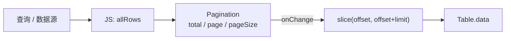

# Pagination 分页组件

## 概述

Pagination 用于数据列表、表格等场景的分页导航。组件自绘翻页按钮与页码信息，支持 **mini**（极简）、**simple**（简洁）、**full**（完整，预留）三种模式。

组件采用**受控模式**：业务侧持有全量数据，Pagination 只管理页码状态；翻页时通过 `onChange` 通知外部更新当前页数据（如 `Table.data = rows.slice(...)`）。

## 模式对比

| 模式 | 典型尺寸 | 展示内容 | 适用场景 |
|------|----------|----------|----------|
| `mini` | 64–96 × 24 | `‹  3/20  ›` 或 `‹  3  ›` | 卡片底栏、弹窗、窄空间 |
| `simple` | 160–240 × 28 | `501-1000 / 10000` + 翻页按钮 | 查询结果栏、列表面板 |
| `full` | 320+ × 32 | 页码窗口、每页条数、跳转（待实现） | 后台管理页 |

```
mini:    [ < ]  3/20  [ > ]

simple:  501-1000 / 10000          [ < ] [ > ]
```

## 基本用法

### simple 模式（DB 编辑器）

```json
{
  "id": "resultPager",
  "type": "Pagination",
  "mode": "simple",
  "size": [220, 28],
  "page": 1,
  "pageSize": 500,
  "total": 0,
  "hideOnSinglePage": true,
  "showTotal": true,
  "events": {
    "onChange": "@onResultPageChange"
  },
  "style": {
    "color": "#A6ADC8",
    "fontSize": 11,
    "buttonBgColor": "#313244",
    "buttonHoverColor": "#45475A",
    "disabledColor": "#45475A",
    "borderRadius": 4,
    "itemSize": 24
  }
}
```

### mini 模式

```json
{
  "id": "cardPager",
  "type": "Pagination",
  "mode": "mini",
  "size": [88, 24],
  "page": 1,
  "pageSize": 20,
  "total": 156,
  "showPageCount": true,
  "events": {
    "onChange": "@onPageChange"
  }
}
```

## 属性说明

### 数据属性

| 属性 | 类型 | 默认值 | 说明 |
|------|------|--------|------|
| `page` | number | `1` | 当前页（**从 1 开始**） |
| `pageSize` | number | `20` | 每页条数 |
| `total` | number | `0` | 总条数 |
| `mode` | string | `"simple"` | `mini` / `simple` / `full` |
| `hideOnSinglePage` | boolean | `false` | 总条数 ≤ `pageSize` 时自动隐藏 |
| `showTotal` | boolean | `true`（simple） | simple 模式显示区间/总数 |
| `showPageCount` | boolean | `false` | mini 模式显示 `3/20` 形式 |

### 样式属性

| 属性 | 说明 |
|------|------|
| `color` | 正文颜色 |
| `activeColor` | 当前页高亮（预留） |
| `disabledColor` | 禁用按钮颜色 |
| `buttonBgColor` | 翻页按钮背景 |
| `buttonHoverColor` | 翻页按钮悬停背景 |
| `fontSize` | 字号 |
| `itemSize` | 翻页按钮边长（mini 默认约 22） |
| `borderRadius` | 按钮圆角 |

## 事件

### onChange

用户点击上一页/下一页后触发。事件载荷写入 `layer.text`（JSON 字符串），与 Table `onSelect` 一致。

```json
{
  "page": 3,
  "pageSize": 500,
  "total": 10000,
  "pageCount": 20,
  "offset": 1000,
  "limit": 500,
  "start": 1001,
  "end": 1500
}
```

| 字段 | 说明 |
|------|------|
| `page` | 新页码（1-based） |
| `offset` | 0-based 起始索引，用于 `slice(offset, offset + limit)` |
| `start` / `end` | 1-based 闭区间，供 UI 展示 |

## JavaScript 用法

```javascript
var pager = yui.find("resultPager");

// 受控更新（不触发 onChange）
pager.pageSize = 500;
pager.total = rows.length;
pager.page = 1;

// 监听翻页
function onResultPageChange(layerId) {
    var pager = yui.find(layerId);
    var state = JSON.parse(pager.text);
    var start = state.offset;
    var end = start + state.limit;
    yui.find("resultTable").data = allRows.slice(start, end);
}
```

### 与 Table 组合



Pagination **不**内置数据切片，也不绑定 Table id；由 `onChange` 回调负责更新 `Table.data`。

## DB 编辑器集成示例

```javascript
var RESULT_PAGE_SIZE = 500;
var resultRowsAll = [];

function showResults(rows, rowCount) {
    resultRowsAll = rows || [];
    var total = rowCount != null ? rowCount : resultRowsAll.length;
    var pager = yui.find("resultPager");
    if (pager) {
        pager.pageSize = RESULT_PAGE_SIZE;
        pager.total = total;
        pager.page = 1;
    }
    renderResultPage(1, RESULT_PAGE_SIZE);
}

function renderResultPage(page, pageSize) {
    var start = (page - 1) * pageSize;
    var table = yui.find("resultTable");
    if (table) table.data = resultRowsAll.slice(start, start + pageSize);
}
```

## 边界行为

| 场景 | 行为 |
|------|------|
| `total = 0` | 显示 `0 / 0`，翻页按钮禁用 |
| `page` 超出范围 | 内部 clamp 到 `[1, pageCount]` |
| JS 设置 `page` / `total` | 不触发 `onChange`，仅刷新显示 |
| `hideOnSinglePage: true` | 当 `total ≤ pageSize` 时组件隐藏 |

## 实现说明

- 类型枚举：`PAGINATION`，JSON `"type": "Pagination"`
- 源文件：`src/components/pagination_component.c`
- 自绘交互区，不创建子 Button Layer
- `full` 模式（页码列表、每页条数选择、跳转输入）计划在后续版本实现

## 相关文档

- [Table 组件](table-component.md)
- [JSON 格式规范](../json-format-spec.md)
